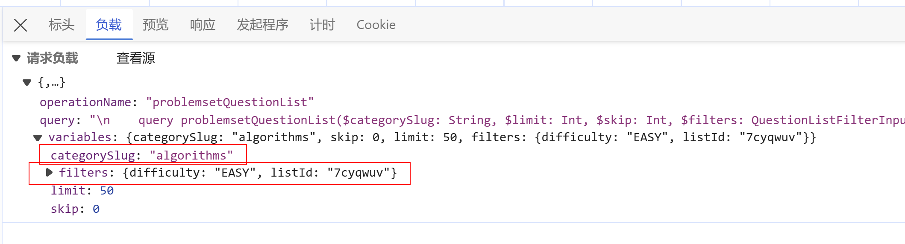
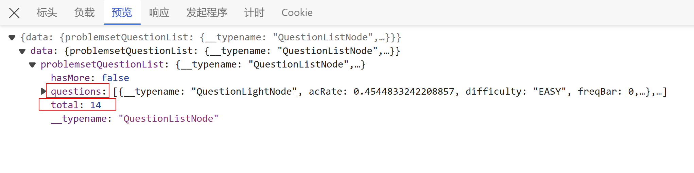
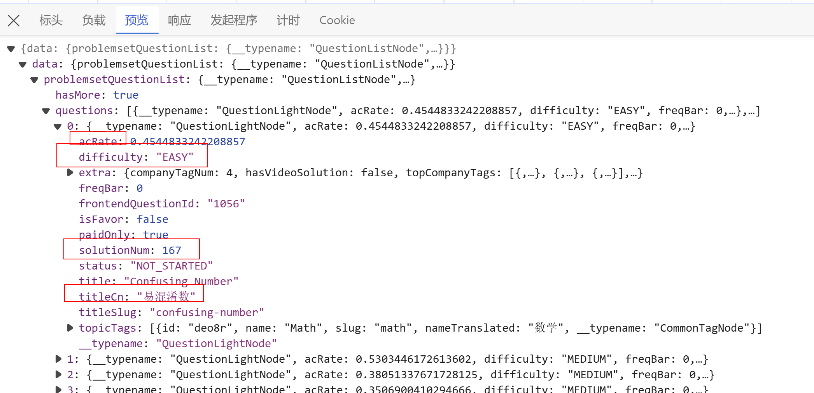

此目录存放本周课后作业，可以在此文件添加作业设计思路和流程图等

### 工具语言使用思路：

#### webpack与Eslint代码规范

webpack来搭建项目，写好必须的配置文件，使用到了ts编程，因此需要生成tsconfig配置并在webpack.config.js中配置可以导入ts，js结尾的模块文件。在进行build前，需要Eslint检验代码规范，通过后即可将所写的html,CSS和ts打包到dist的app.js和index.html。

#### Whistle与请求相关内容的确定

由于页面的数据需要向leetcode发送请求，因此写好的页面需要由live server打开，并通过whistle进行代理
（解决一个跨域请求冲突的问题），然后根据leetcode交互的内容将请求的数据写好发送的请求体内容。 


#### 请求参数写入位置和响应值的类型确定



查看原网站的一些请求，只需要获得交互事件的类型，将其作为值写入body的categorySlug和filters中。可以看出来类别是写在categorySlug，而题单和难度的值是写入filters中。以此可以确定body的数据类型






根据返回的响应可以看出数据的格式和对应的值，以此可以确定响应的数据类型。并尝试使用Axios来发送请求

1、封装axios请求相关的方法，创建通用的 fetch 方法

```ts
import axios from 'axios';

// 创建 Axios 实例
const instance = axios.create({
  baseURL: 'https://api.example.com', // 设置默认的基础 URL
  timeout: 10000, // 设置默认超时时间
});

// 添加请求拦截器
instance.interceptors.request.use(
  (config) => {
    // 在发送请求之前做些什么，例如添加 token 到 headers
    return config;
  },
  (error) => {
    // 处理请求错误
    return Promise.reject(error);
  }
);

// 添加响应拦截器
instance.interceptors.response.use(
  (response) => {
    // 对响应数据做点什么
    return response.data;
  },
  (error) => {
    // 根据错误码做一些事情，例如错误通知
    return Promise.reject(error);
  }
);

// 创建一个通用的 fetch 方法
async function fetch<T>(url: string, method: 'GET' | 'POST' = 'GET', data?: object, config?: object): Promise<T> {
  const response = await instance({ url, method, data, ...config });
  return method === "POST"? response.data.problemsetQuestionList : response;
}

export default fetch;
```

2、根据leetcode的请求体确定类型

```ts
// 请求体
interface Body {
  query:string;
  variables:Variables;
  operationName:string;
}

interface Variables {
  categorySlug:string;
  skip:number;
  limit:number;
  filters:{[key: string]: string | null};
}
```

3、确定响应的类型

```ts
// 响应数据的类型声明
interface QuestionListNode {
  questions: QuestionLightNode[];
  total: number;
  hasMore: boolean;
}

interface QuestionLightNode {
  acRate: number;
  difficulty: "EASY" | "MEDIUM" | "HARD";
  freqBar: number;
  paidOnly: boolean;
  status: string;
  isFavor: boolean;
  solutionNum: number;
  title: string;
  titleCn: string;
  titleSlug: string;
}
```

4、封装函数

```ts
// 向leetcode post页面展示的题目数据
async function postExample(body : Body) : Promise<QuestionListNode>{
    // 请求头写死了
  const headers : object = {
    "accept": "*/*",
    "accept-language": "zh-CN,zh;q=0.9",
    "baggage": "sentry-environment=production,sentry-release=463ce6b1,sentry-transaction=%2Fproblemset%2F%5B%5B...slug%5D%5D,sentry-public_key=1595090ae2f831f9e65978be5851f865,sentry-trace_id=9b0efe3e5e354e1aaa32bd3d84913f85,sentry-sample_rate=0.03",
    "content-type": "application/json",
    "random-uuid": "67e5ccae-64aa-a3bb-2a66-ea79acef2a2e",
    "sentry-trace": "9b0efe3e5e354e1aaa32bd3d84913f85-9ba7f8224634bfc6-0",
    "x-csrftoken": "2W2ZJF5EleSiFYPT3oMklD1DctFx6lALDR3lB7ZifQHAXNY95jZDqrf3OpckK7ed",
  };
  const data: QuestionListNode = await fetch('https://leetcode.cn/graphql/', 'POST', body, headers);
  return data;
}
```


### 页面排版思路

页面位于浏览器的版心位置，margin 30px auto 0;

画面分为上下两部分:上部分为导航区,下部分为数据为数据展示区

上部分为分类和难度题单选择区域

下部分分为两个区域：表头和拉过来展示的数据内容


### 交互思路

页面加载时，展示全部题目的内容  ----->  页面加载向服务器发起请求获取全部题目

点击其他类别  ------> 提取该类别的关键词，重复上面的步骤

点击难度和题单 ------> 弹出隐藏的选项栏，点击需要的选项，重复上面的步骤并隐藏掉选项栏


