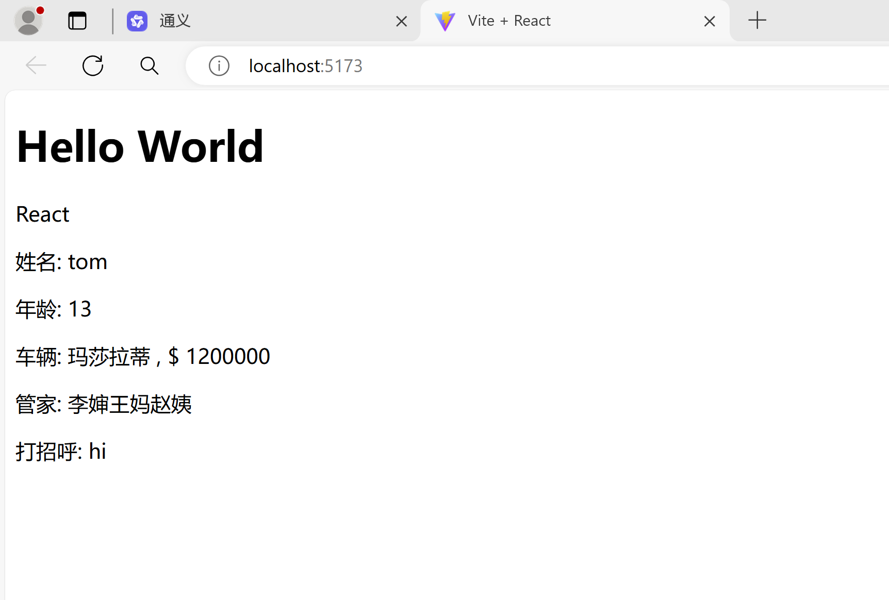
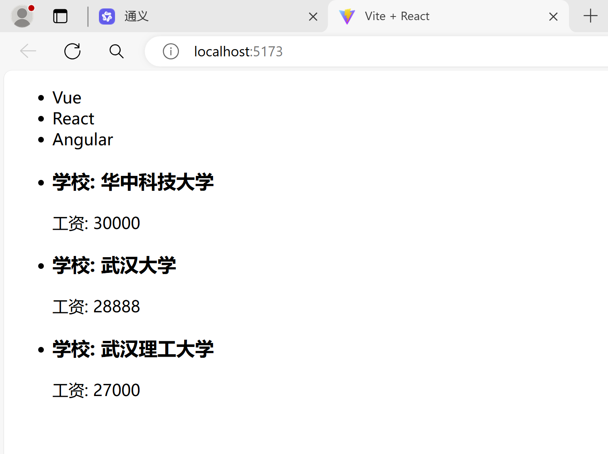
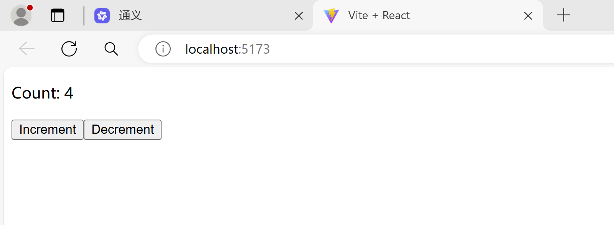
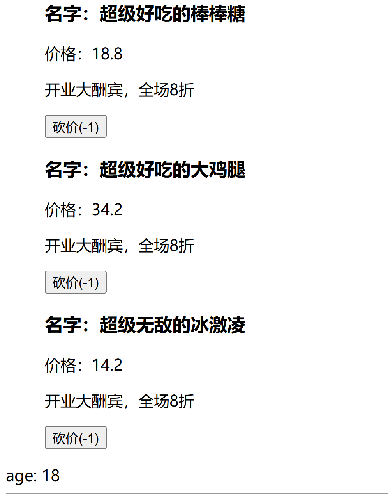
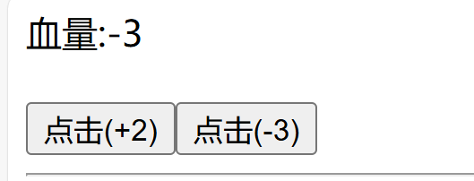

此目录存放课堂作业，可以在此文件添加作作业思路和对题目的看法

#### React_Vite

##### React

[React](https://react.dev/) 是一个用于构建**用户界面**的 `JavaScript` **库** 

其特点主要有：

- **声明式**

> 只需要描述 UI（HTML）看起来是什么样子，就像写 HTML 一样简单，React 内部负责渲染 UI，并在数据变化时自动更新 UI。

- **组件化**

> 把复杂的页面拆分成一个一个的单元，这些组成页面的基本单元就是组件，通过组合、复用组件来编写复杂界面的方式，就是组件化。

- **一次学习，随处使用**

> 使用 React 除了可以开发 Web 应用，还可以使用 React Native 开发原生移动应用，甚至可以开发 VR（虚拟现实）应用（React 360）。

- **相比较于 Vue**

> React 强调尽可能的利用 JS 语言自身的能力来编写 UI，而不是通过造轮子增强 HTML 的功能。

##### Vite

[Vite](https://cn.vitejs.dev/)是一个由 Evan You创建的现代前端构建工具。在开发模式下，它通过原地转换来处理模块，而不是先构建一个打包好的静态资源文件。这意味着当您启动 Vite 时，它几乎可以立即加载您的应用，并且在保存文件时能够迅速地进行增量编译和热模块替换。

关键特性：

- **快速启动**：

  > 在开发环境中，Vite 不需要预先构建整个项目，而是按需加载和转换文件，因此启动速度非常快。

- **热模块替换 (HMR)**：

  > 当源代码发生改变并保存时，Vite 可以只更新变动的部分，而不需要重新加载整个页面，这大大提高了开发效率。

- **按需编译**：

  > Vite 只编译那些确实被请求的模块，而不是一开始就编译整个项目。

- **生产构建优化**：

  > 虽然开发模式下是动态编译，但在生产环境下，Vite 会执行标准的构建过程，包括压缩、树摇等优化手段。

- **TypeScript 支持**：

  > Vite 原生支持 TypeScript，并且可以很好地与 TypeScript 项目集成


#### Vite搭建React_js项目

需要下载了node，并且版本需要大于12.0.0。

##### 使用vite命令创建项目

 ```bash
# 以下两种方式二选一
npm init vite
npm create vite@latest
 ```

按照弹出的内容输入项目名称、选择项目框架（React，Vue等等）以及选择开发的语言（ts,js等），完成项目的创建工作。

##### 启动项目

- 进入项目：cd demo
- 安装依赖：npm install
- 启动项目：npm run dev

**遇到的问题**：使用 `npm install` 时遇到无法下载依赖。

**解决思路**：

> 1. 检查笔记本是否断网
>
> 2. 可能下载的包在国外，导致下载失败，更换npm源
>
>    查看当前npm的源：`npm config get registry`
>
>    更换为腾讯云：`npm config set registry https://mirrors.cloud.tencent.com/npm/`
>
>    清空一下npm缓存：`npm cache clean --force`

启动项目 ，本地打开网站就能看见一个渲染好的界面。


#### 了解jsx

##### jsx

JSX 是 JavaScript XML 的简写，表示可以在 JavaScript 代码中写 XML（HTML） 格式的代码。

**优势：**声明式语法更加直观，与 HTML 结构相同，降低了学习成本，提高了开发效率，JSX 是 React 的核心之一。去了解一些它的使用。

##### 基本使用

> 删掉刚刚创建好的项目src下的内容，并新建文件main.jsx，在文件下学习jsx的一些使用。

```jsx
import React from "react";
import ReactDOM from "react-dom/client";

// jsx创建react元素
const r = (
    <div className="wrap">
      <h1>Hello World</h1>
      <p>React</p>
    </div>
)
// 将其渲染到页面上
ReactDOM.createRoot(document.getElementById("root")).render(r)
```

保存更新的内容后，再打开网页就可以看见上述内容

**一些注意点**：

- 必须有 1 个根节点，或者虚拟根节点 `<></>`、`<React.Fragment></React.Fragment>`。
- 属性名一般是驼峰的写法且不能是 JS 中的关键字，例如 class 改成 className，label 的 for 属性改为 `htmlFor`，colspan 改为 `colSpan`。
- 元素若没有子节点，可以使用单标签，但一定要闭合，例如 `<span/>`。
- [`React@16.14`](mailto:React@16.14) 之前需要先引入 React 才能使用 JSX（这个也好理解，因为 JSX 最后还是要被转成 `React.createElement()` 的形式）。
- 换行建议使用 `()` 进行包裹，防止换行的时候[自动插入分号](https://stackoverflow.com/questions/2846283/what-are-the-rules-for-javascripts-automatic-semicolon-insertion-asi)的 Bug。

##### 使用表达式

> 将一些数据插入到页面中，单大括号中可以使用任意js的表达式、函数、数组和对象的属性等（除了直接整个对象）

```jsx
// 数据类型
let name = 'tom'
let age = 13
// 对象的属性
let car = {
    brand : "玛莎拉蒂",
    price : 1200000,
}
// 数组的一项甚至整个数组
let arr = ["李婶", "王妈", "赵姨"]
// 调用函数
let hi = () => "hi"

const r = (
    <div className="wrap">
      <h1 className="title">Hello World</h1>
      <p>React</p>
      <p>姓名: { name }</p>
      <p>年龄: { age }</p>
      <p>车辆: { car.brand } , $ { car.price }</p>
      <p>管家: { arr }</p>
      <p>打招呼: { hi() }</p>
    </div>
);
ReactDOM.createRoot(document.getElementById("root")).render(r)
```



##### 列表渲染

> 后台返回的数据一般json解析成为list的数据，需要将其装入到页面上。可以使用 `map()` 方法渲染一组数据。

```jsx
const list = [
    { id: 1, name: "Vue" },
    { id: 2, name: "React" },
    { id: 3, name: "Angular" },
]

const list1 = [
    { id: 1, name: "华中科技大学", salary: 30000 },
    { id: 2, name: "武汉大学", salary: 28888 },
    { id: 3, name: "武汉理工大学", salary: 27000 },
]

const r2 = list1.map((item) => (
    <li key={item.id}>
        <h3 className="title">学校: { item.name }</h3>
        <p>工资: { item.salary }</p>
    </li>
))

const r1 = list.map((item) => <li key={item.id}>{item.name}</li>) 

const r = (
    <div className="wrap">
      <ul>{ r1 }</ul>
      <ul>{ r2 }</ul>
    </div>
);
ReactDOM.createRoot(document.getElementById("root")).render(r)
```



**注意点：**`关于 key`

- **特点：**key 值要保证唯一，尽量避免使用索引号，key 在最终的 HTML 结构中是看不见的；
- **作用：**React 内部用来进行**性能优化**时使用的，key 在最终的 HTML 结构中是看不见的；
- **加在哪里：**`map()` 遍历谁，就把 key 加在谁上。

##### 样式的处理

两种方式：行内样式和className

**行内样式**

在style属性中使用对象去添加行内样式

```jsx
<div style={{ width: 200, height: 200, color: 'red' }}>React</div>
```

**注意点：**

两个{{}}，外层的{}表示要开始js语句了，里面的{}指明了是一个对象。内容是CSS样式，本来是符号链接的属性则改成了小驼峰的写法，数值可不带单位。

**className**

需要在css文件中写好样式，在`src`下创建`index.css`文件。通过import引入`main.jsx`

`index.css`

```css
p {
    color: red;
}

.title {
    color: aquamarine;
    font-size: 18px;
}

.wrap {
    background-color: blue;
}
```

`main.jsx`

```jsx
import React from "react";
import ReactDOM from "react-dom/client";
import "./index.css"

let name = 'tom'
let age = 13
let car = {
    brand : "玛莎拉蒂",
    price : 1200000,
}
let arr = ["李婶", "王妈", "赵姨"]

let hi = () => "hi"

const list = [
    { id: 1, name: "Vue" },
    { id: 2, name: "React" },
    { id: 3, name: "Angular" },
]

const list1 = [
    { id: 1, name: "华中科技大学", salary: 30000 },
    { id: 2, name: "武汉大学", salary: 28888 },
    { id: 3, name: "武汉理工大学", salary: 27000 },
]

const r2 = list1.map((item) => (
    <li key={item.id}>
        <h3 className="title">学校: { item.name }</h3>
        <p>工资: { item.salary }</p>
    </li>
));

const r1 = list.map((item) => <li key={item.id}>{item.name}</li>) 

const r = (
    <div className="wrap">
      <h1 className="title">Hello World</h1>
      <p>React</p>
      <p>姓名: { name }</p>
      <p>年龄: { age }</p>
      <p>车辆: { car.brand } , $ { car.price }</p>
      <p>管家: { arr }</p>
      <p>打招呼: { hi() }</p>
      <ul>{ r1 }</ul>
      <ul>{ r2 }</ul>
    </div>
);
ReactDOM.createRoot(document.getElementById("root")).render(r)
```


#### 组件基础

##### 介绍

> 组件就是页面中的一部分，是 React 的一等公民，使用 React 就是在用组件，而所谓的组件化开发就是采用分而治之的思想来管理繁杂的页面逻辑。

**其特点：**

独立、可复用、可组合。

**分类：**

> - 功能使用：UI 组件（AntD）和业务组件（留言板）；普通组件（在一个组件中直接使用的组件）和路由组件（通过路由跳转访问到的组件）；
> - 创建方式：函数组件和类组件。

##### 函数式组件

**步骤：**

1. > 1. 先定义；
   >
   > 2. 1. 函数名称**必须以大写字母开头**；
   >    2. **必须有返回值** ，返回值表示该组件的结构，如果不想渲染任何内容，可以 `return null`。
   >
   > 3. 再使用。
   >
   > 4. 1. `<函数名/>`，单标签闭合；
   >    2. `<函数名></函数名>`，双标签。

```jsx
import ReactDOM from "react-dom/client";

function Hello() {
  return <div>这是第一个函数组件</div>;
}

// 把函数的名字作为标签名进行渲染，可以使用单闭合，或双标签的形式
ReactDOM.createRoot(document.getElementById("root")).render(<Hello />)
```

##### 事件绑定

> **语法：**React 事件名采用驼峰命名法，比如 onClick、onMouseEnter 等。

```jsx
const App = () => {
    const handleClick = () => {
        console.log('Hello World')
    }
    return <button onClick={handleClick}>click</button>
}
```

通过形参 `e` 可以拿到事件对象，例如 `e.target` 就是触发事件的那个 DOM 元素。

##### 组件的状态

**特点：**状态能被改变，改变了之后视图会有对应的变化。

**作用：**保存数据；数据变化响应到视图（React 包内部的操作）。

##### useState了解

> 为函数组件提供状态和修改状态的方法。

使用步骤：导入useState函数，调用函数并设置初始值，根据返回值取得状态和状态修改函数

`State.jsx`

```jsx
import React, { useState } from 'react';

function Counter() {
  // 初始化状态值为 0
  const [count, setCount] = useState(0);

  // 增加计数器
  const increment = () => {
    setCount(count + 1);
  };

  // 减少计数器
  const decrement = () => {
    setCount(count - 1);
  };

  return (
    <div>
      <p>Count: {count}</p>
      <button onClick={increment}>Increment</button>
      <button onClick={decrement}>Decrement</button>
    </div>
  );
}

export default Counter;
```

`main.jsx`

```jsx
import React from "react";
import ReactDOM from "react-dom/client";
import Counter from "./State.jsx"

ReactDOM.createRoot(document.getElementById("root")).render(<Counter />)
```




#### 组件通信

> 组件通讯的三种方式（父子、子父、兄弟）以及 Context 实现跨层级通讯

##### 概念

**为什么需要组件通讯？**

- 组件是独立且封闭的单元，默认情况下，只能使用组件自己的数据；
- 在组件化过程中，我们将一个完整的功能拆分成多个组件，以更好的管理整个应用的功能；
- 而在这个过程中，多个组件之间不可避免的要**传递或共享某些数据**；
- 为了实现这些功能，就需要打破组件的独立封闭性，让其与外界沟通，这个过程就是通讯；
- 组件通信常见的方式有：**父传子、子传父、兄弟相传、跨组件通信**等。

##### 父传子

1. 父组件（使用组件的地方）通过自定义属性提供数据
2. 子组件（定义组件的地方）通过 props 接收。

**Tips：**

- Props 是只读的，不能修改；

- 单向数据流，也叫做：自上而下的数据流；

- 1. 当父组件中的数据更新时，子组件接收到的数据也会自动更新；
  2. 但不能反过来，例如子组件直接去修改父组件的数据；
  3. 类比：就像瀑布的水一样只能从上往下流动，并且，当上游的水变浑浊，下游的水也会受到影响。

- 可以给组件传递任意类型的数据，例如数字、字符串、布尔、对象、函数、JSX 等。

`父组件Parent.jsx`

```jsx
import React, { useState } from 'react'
import Child1 from './Child1'

export default function Parent() {
  const [salary] = useState(100)

  return (
    <div>
      Parent: { salary }
      <Child1 salary={ salary }></Child1>
    </div>
  )
}
```

`子组件Child1.jsx`

```jsx
import React from 'react'

// 直接解析Props 
export default function Child1({salary}) {
  return (
    <div>
      Child1:{ salary }
    </div>
  )
}
```


对于列表数据同样的实现思路：通过useState去设置组件的数据 ==> 得到数据和修改数据的方法，例如下面的例子：数据都是放在父组件，通过状态传递给子组件，数据变化视图也会跟着发生变化。

`父组件Parent1.jsx`

```jsx
import React, { useState } from 'react'
import Child2 from './Child2'

export default function Parent1() {
    const [state] = useState({
        list:[
            {
              id: 1,
              name: "超级好吃的棒棒糖",
              price: 18.8,
              info: "开业大酬宾，全场8折",
            },
            {
              id: 2,
              name: "超级好吃的大鸡腿",
              price: 34.2,
              info: "开业大酬宾，全场8折",
            },
            {
              id: 3,
              name: "超级无敌的冰激凌",
              price: 14.2,
              info: "开业大酬宾，全场8折",
            },
        ],
        age : 18,
    })
    return (
        <>
            <ul>
                { state.list.map( (item) => (
                    <Child2 key={ item.id } { ...item }/>
                ))
                }
            </ul>
            <div>age: { state.age }</div>
        </>
    )
}
```

`子组件Child2.jsx`

```jsx
import React from 'react'

export default function Child2({name,price,info}) {
  return (
    <div>
      <h3>名字：{ name }</h3>
      <p>价格：{ price }</p>
      <p>{ info }</p>
    </div>
  )
}
```

##### 子传父

现在提出一个需求：上述的菜单价格，给出了一个砍价的功能，每点击一下砍价，菜品的价格会减少一定金额。

**思路：**由于是单向数据流，因此不能直接在子组件中更改价格，需要子向父传递砍价的金额，来改变放在父组件的数据。进而改变视图。

**做法：**

1. 父组件通过属性传递一个回调函数；
2. 子组件调用传递过来的回调函数，并将要传递的数据作为回调函数的实参；
3. 父组件在回调函数中通过形参接收传递过来的数据并做相应操作。

`父组件Parent1.jsx`

```jsx
import React, { useState } from 'react'
import Child2 from './Child2'

export default function Parent1() {
    const [state,setState] = useState({
        list:[
            {
              id: 1,
              name: "超级好吃的棒棒糖",
              price: 18.8,
              info: "开业大酬宾，全场8折",
            },
            {
              id: 2,
              name: "超级好吃的大鸡腿",
              price: 34.2,
              info: "开业大酬宾，全场8折",
            },
            {
              id: 3,
              name: "超级无敌的冰激凌",
              price: 14.2,
              info: "开业大酬宾，全场8折",
            },
        ],
        age : 18,
    })
    const handleClick = (id, downPrice) => {
        setState({
            ...state,
            list : state.list.map((item) => {
                if(item.id === id){
                    let newprice = (item.price - downPrice).toFixed(2)
                    if(newprice < 0) {
                        newprice = 0
                    }
                    item.price = newprice
                } 
                return { ...item }
            }),
        })
    }
    return (
        <>
            <ul>
                { state.list.map( (item) => (
                    <Child2 
                        key={ item.id } 
                        { ...item } 
                        handleClick={ (price) => handleClick(item.id,price) }
                    />
                ))
                }
            </ul>
            <div>age: {state.age}</div>
        </>
    )
}
```

`子组件Child2.jsx`

```jsx
import React from 'react'

export default function Child2({name, price, info, handleClick}) {
  return (
    <div>
      <h3>名字：{ name }</h3>
      <p>价格：{ price }</p>
      <p>{ info }</p>
      <button onClick={() => handleClick(1)}>砍价(-1)</button>
    </div>
  )
}
```



##### 兄弟组件的通信

只学过父与子，因此开发的时候思考兄弟组件的公共父组件，将兄弟组件间的通信转换为了父与子的通信。

因此一个 **需求需要完成：**点击 A 中的按钮，修改 B 中的数据 count。

1. 准备 A、B 兄弟组件；
2. 把需要操作的 B 组件中的数据 count 提升到公共的父组件里面；
3. **父组件提供数据和操作数据的方法**；
4. 把数据传递给 B 组件，把操作数据的方法传递给 A 组件。

`公共父亲CommonParent.jsx`

```jsx
import React, { useState } from 'react'
import Brother1 from './Brother1'
import Brother2 from './Brother2'

export default function CommonParent() {
    const [state,setState] = useState(100)

    // 加减血
    let upDownBoold = (blood) => {
        setState(state + blood)
    }

    return (
        <div>
            <Brother2 blood={state}></Brother2>
            <br></br>
            <Brother1 upDownBoold={upDownBoold}></Brother1>
            <hr></hr>
        </div>
    )
}
```

`兄弟B Brother2.jsx`

```jsx
import React from 'react'

export default function Brother2({ blood }) {
  return (
    <div>
      血量:{blood}
    </div>
  )
}
```

`兄弟A  Brother1.jsx`

```jsx
import React from 'react'

export default function Brother1({ upDownBoold }) {
  return (
    <div>
        <button onClick={() => upDownBoold(2)}>点击(+2)</button>
        <button onClick={() => upDownBoold(-3)}>点击(-3)</button>
    </div>
  )
}
```



##### Context

远房亲戚关系（也就是两个组件之间间隔较远），可以使用 Context。

1. 祖先组件通过 `React.createContext()` 创建 Context 并导出；
2. 祖先组件通过 `<Context.Provider>` 配合 value 属性提供数据；
3. 后代组件通过 `<Context.Consumer>` 配合函数获取数据；
4. 优化：提取 `React.createContext()` 到单独的文件里面。


#### Hooks 基础

##### 是什么

- `Hooks`：钩子、钩住，是 [`React@16.8`](mailto:React@16.8) 提供的新功能。
- 作用：为函数组件提供状态、生命周期等原本 class 组件中才有的功能，可以理解为通过 Hooks 为函数式组件钩入了 class 组件的特性。
- [`React@16.8`](mailto:React@16.8) 以前，class 组件（提供状态和生命周期） + 函数组件（展示内容）。
- [`React@16.8`](mailto:React@16.8) 以后，class 组件（提供状态和生命周期） + 函数组件（展示内容），Hooks（提供状态和生命周期） + 函数组件（展示内容），也可以混用这两种方式，即部分功能用 class 组件，部分功能用 Hooks + 函数组件。
- 注意：**Hooks 只能在函数组件中使用** ，虽然有了 Hooks，但 [React 官方](https://zh-hans.reactjs.org/docs/hooks-intro.html)并没有计划从 React 库中移除 class。

##### useEffect

- 类比，对于 999 感冒灵来说；

- 1. 主作用：用于治疗感冒引起的头痛，发热，鼻塞，流涕，咽痛等；
  2. 副作用：可见困倦、嗜睡、口渴、虚弱感。

- 那组件或一般函数的副作用是什么呢？

- 1. 组件的副作用：对于 React 组件来说，主作用就是根据数据（state/props）**渲染 UI** ，除此之外都是副作用，比如手动修改 DOM、数据（AJAX）请求、localStorage 操作等；
  2. 函数的副作用：如果一个函数修改了其局部环境之外的数据，那么它就被称为有副作用。

- 关于 useEffect。

  作用：当你想要在函数组件中处理副作用（side effect），就要使用 useEffect 了。

##### 基本使用

提出一个小需求：点击按钮，让数字加 1，并把变化后的数字展示在网页标题上。

**思路：**

1. 初始化时渲染数据到网页标题上。
2. 当数据变化的时候把变化后的数据渲染到网页标题上。

```jsx
import React, { useEffect, useState } from 'react'

export default function App() {
  const [count, setCount] = useState(0)
  
  useEffect(() => {
    document.title = count
  })

  return (
    <div>
        <p>{count}</p>
        <button onClick={() => setCount(count + 1)}>+1</button>
    </div>
  )
}
```

**问题：**组件中还有其他状态，其他状态更新时，刚刚的 effect 回调（修改标题的操作）也会执行

优化：**如何跳过不必要的执行，只有在 count 变化时，才执行相应的 effect** 。

解决办法：useEffect第二个参数可以传一个数组，表示只有当数组中的选项/依赖项改变时，才会重新执行该 effect。

```jsx
import React, { useEffect, useState } from 'react'

export default function App() {
  const [count, setCount] = useState(0)
  const [age, setAge] = useState(18)
  
  useEffect(() => {
    document.title = count
  }, [count])

  return (
    <div>
        <p>{count}</p>
        <button onClick={() => setCount(count + 1)}>+1</button>
        <button onClick={() => setAge(age + 1)}>+1</button>
    </div>
  )
}
```

useEffect第二个参数不同依赖项写法的含义：

```
不写依赖项
	- 初始化的时候会执行
	- 任何状态发生变化的时候会执行
依赖项是 [count, age]
	- 初始化的时候会执行
	- count 和 age 状态发生变化的时候会执行
依赖项是 []
	- 初始化的时候会执行
	- 场景：初始化的时候发请求、绑定事件
```

**Tips：**

- 和 useState 一样，一个组件中也可以调用多次 useEffect。
- 推荐：一个 useEffect 只处理一个功能，有多个功能时，使用多次 useEffect。

##### Demo:倒计时

需求：**完成一打开页面就进行倒计时的效果。**

问题：会出现闭包问题（自行查阅），一般是外部的变量由于内部函数占用导致无法释放掉。一直指向初始的值

```jsx
import React, { useEffect, useState } from 'react'

export default function App() {
  const [count, setCount] = useState(10)

  useEffect(() => {
    setInterval( () => setCount(count => count - 1), 1000)
  }, [])
  
  return (
    <div>
        <p>{count}</p>
    </div>
  )
}
```

#### Hook进阶

##### useEffect清除副作用

- useEffect 可以返回一个函数，这个函数称为清理函数，在此函数内用来执行清理相关的操作（例如事件解绑、清除定时器等）；
- 清理函数的执行时机：下一次 副作用回调函数调用时以及组件卸载时；
- 建议：一个 useEffect 只用来处理一个功能，有多个功能时，可以使用多个 useEffect。

**演示：**用一个按钮来消除页面的倒计时效果，涉及到倒计时组件的销毁过程，会用到useEffect的返回函数。

`APP组件App.jsx`

```jsx
import React, { useState } from 'react'
import Useeffect from './Components/Useeffect'

export default function App() {
  const [state,setState] = useState(true)

  return (
    <div>
      { state && <Useeffect></Useeffect>}
      <button onClick={() => setState(!state)}>销毁/创建倒计时</button>
    </div>
  )
}
```

`Useeffect.jsx`

```jsx
import React, { useEffect, useState } from 'react'

export default function Useeffect() {
    const [count, setCount] = useState(10)

    useEffect(() => {
        const timer = setInterval( () => {
            setCount(count => count - 1)
            console.log(111);
        }, 1000)
        return () => {
            clearInterval(timer)
        }
    }, [])

    return (
        <div>
        	<p>{count}</p>
        </div>
    )
}
```

##### 自定义hook

**引入Demo：**跟随鼠标移动的头像

**思路：**

1. 通过 useState 提供状态；
2. 通过 useEffect 给 document 注册鼠标移动事件；
3. 在事件回调里面修改状态为鼠标的坐标；
4. 组件销毁的时候记得清理副作用（解绑事件）。

`App.jsx`

```jsx
import React, { useState } from 'react'
import Mousemove from './Components/Mousemove'

export default function App() {
  return (
    <div>
      <Mousemove></Mousemove>
    </div>
  )
}
```

`Mousemove.jsx`

```jsx
import React, { useEffect, useState } from 'react'
import vite from '../../public/vite.svg' 
 
export default function Mousemove() {
    const [pos,setPos] = useState({
        x:0,
        y:0,
    })
    useEffect( () => {
        const move = (e) => {
            const { clientX, clientY } = e;
            setPos({
                x : clientX,
                y : clientY,
            })
        }
        document.addEventListener('mousemove', move)
        
        return () => {
            document.removeEventListener('mousemove', move)
        }
    },[])
    return (
        <div>
        </img>
        </div>
    )
}
```

**自定义hook**

现在我想在其他组件里获得这个鼠标的位置，再来写一段这个代码吗？怎么将其封装复用起来？

用到了自定义hook：

- 目的：复用状态逻辑；
- 自定义 Hook 是一个函数，规定函数名称必须以 use 开头，格式是 useXxx，React 内部会据此来区分是否是一个 Hook；
- 自定义 Hook 只能在函数组件或其他自定义 Hook 中使用，否则，会报错！

`mousepos.jsx`

```jsx
import { useEffect, useState } from 'react'

export default function useMousepos() {
    const [pos,setPos] = useState({
        x:0,
        y:0,
    })
    useEffect( () => {
        const move = (e) => {
            const { clientX, clientY } = e;
            setPos({
                x : clientX,
                y : clientY,
            })
        }
        document.addEventListener('mousemove', move)
        
        return () => {
            document.removeEventListener('mousemove', move)
        }
    },[])
  return pos
}
```

Mousemove.jsx

```jsx
import React from 'react'
import vite from '../../public/vite.svg' 
import useMousepos from '../Hooks/mousepos'
 
export default function Mousemove() {
    const pos = useMousepos()
    return (
        <div>
        </img>
        </div>
    )
}
```

##### useRef 操作 DOM

- 参数：在获取 DOM 时，一般都设置为 null；
- 返回值：返回一个带有 current 属性的对象，通过该对象就可以得到 DOM 对象或类组件实例。

**基本使用：**

​	使用 useRef 创建一个有 current 属性的 ref 对象，{ current: null }。

```jsx
const xxxRef = useRef(null)
```

​	通过 DOM 的 ref 属性和上面创建的对象进行关联。

```jsx
<div ref={xxxRef}></div>
```

​	通过 xxxRef.current 就可以访问到对应的 DOM 啦。

```jsx
import React, { useRef } from "react";

const App = () => {
  const inputRef = useRef(null);
  const add = () => {
    console.log(inputRef.current.value);
  };
  return (
    <section>
      <input placeholder="请输入内容" ref={inputRef} />
      <button onClick={add}>添加</button>
    </section>
  );
};

export default App;
```

> useRef 每次都会返回相同的引用，而 createRef 每次渲染都会返回一个新的引用。

#### Redux

##### 1、 传统Redux

它是一个全局状态管理的js库。

a. 集中式存储和管理应用的状态 ，处理组件通讯问题时，无视组件之间的层级关系；
b. 简化复杂应用中的数据传递问题 ，数据流清晰，易于定位 Bug。

**核心概念**

🌳 为了让代码各部分职责清晰、明确，Redux 提出三个核心概念，需要我们写代码的时候遵守：

- action（动作）：描述要做的事情（要干啥）；
- reducer（函数）：更新状态（怎么干）；
- store（仓库）：整合 action 和 reducer（谁来指挥）。

🚀 通过例子来理解三个核心概念:

- action：相当于公司里面要做的事情，比如打扫卫生这个事等；
- reducer：相当于公司的员工，负责执行；
- store：相当于公司的老板；

**流程**
老板（store）分配（dispatch）要做的事情（action）给员工（reducer），员工干完活把结果交给老板。在视图当中，通过 store dispatch 一个 action，reducer 会自动收到通知来更新 state，state 一旦变化，说有使用 state 的视图自然就变了。

**Action**

🤔 action 用来描述要做的事情，项目中的每一个功能都是一个 action，比如：

- 计数器案例：计数器加 1、减 1；
- todomvc 案例：添加任务、删除任务等；
- 项目：登录，退出等。

🌳 特点：

- 只描述做什么；
- 本质上就是一个 JS 对象，必须带有 type 属性，用于区分动作的类型；
- 可以通过 payload 携带额外的数据。

```jsx
{ type： 'increment' }

// payload: 参数
{ type： 'decrement', payload： 2 }

{ type: 'addTodo', payload: '吃饭' }
{ type: 'addTodo', payload: '睡觉' }
{ type: 'removeTodo', payload: 3 }
```

**问题：**直接使用对象来创建 action 不灵活，参数写死了?
🎉 解决：可以使用函数来创建 action，通过传参把不一样的数据传递过去就好了，我们把这个创建 action 的函数叫做 actionCreator。
🌳 返回值：返回一个 action 对象。
🚀 好处：代码更加简洁，容易复用。

```jsx
export const increment = (payload) => ({
  type: 'INCREMENT',
  payload,
})

export const decrement = (payload) => ({
  type: 'DECREMENT',
  payload,
})
```

**reducer**

reducer：本质上是一个函数，作用是根据 action 来更新状态，有如下特点：

- 函数签名为：(prevState, action) => newState；
- 接收上一次的状态和 action，根据 action 的类型执行对应的操作，最终返回新的状态；
- 原则：不要在 reducer 函数内部直接修改 state

```jsx
export default function counter(state = 10, action) {
    // 处理各种各样的 action
    switch (action.type) {
        case 'INCREMENT':
            return state + action.payload
        case 'DECREMENT':
            return state - action.payload
        default:
            // 记得要有默认返回的处理
            return state
    }
}
```

**Store** 

Store：仓库，是 Redux 的核心，负责整合 Action 和 Reducer，基本特点如下：

- 一个应用只有一个 Store；
- 创建：const store = createStore(reducer)；
- 获取数据：store.getState()；
- 更新数据：store.dispatch(action)。

**其他 API**

- 订阅（监听）状态变化：const unSubscribe = store.subscribe(() => {})，注意要先 订阅，后续的更新才能被观测到；
- 取消订阅状态变化：unSubscribe()。

```jsx
// store: 整个数据的仓库，负责关联 reducer 和 action，通过 store 对象可以给 reducer 分配 action
import { createStore } from 'redux'
import reducer from './reducers'
const store = createStore(reducer)
export default store
```

##### Redux执行流程

1. 只要创建 store，Redux 内部就会调用一次 reducer
2. 类似：`reducer(undefined,{type:"@@reJux/INITv.a.4.t.t.p })`
3. 这一次调用 reducer 的目的：**获取状态的默认值**
4. 因为传入的状态值是 undefined ，并且是一个随机的的 action type，所以，
5. - 状态值是undefined，所以我们设置的默认值就会生效，比如，此处的：10;
   - 因为是一个随机的 action type，所以，redcer 中 switch 一定无法命中，那就一定会走 default。也就是直接返回了状态的默认值，也就是10。
6. Redux 内部拿到这个数据(比如此处的 10)以后，就用这个数据作为了 store 中的最新状态值;
7. 因此，将来当我们调用方法`store.getstate()`来获取 Redux 状态值的时候，拿到的就是 10 了。

##### 点击事件后的执行过程

1. 点击按钮，派发动作store.dispatch(action)。
2. 只要触发action，Redux就会自动调用reducer，根据上一次的状态和action计算新的状态并返回。
3. reducer执行完毕后，将最新的状态交给store，store用最新的状态替换旧状态，状态更新完毕。

##### 2、React-Redux

使用react-redux就与传统的使用方法不同了。

`界面渲染main.jsx`

```jsx
import ReactDOM from "react-dom/client";
import App from "./App";
import store from "./store";
import { Provider } from "react-redux"

ReactDOM.createRoot(document.getElementById("root")).render(
    <Provider store={store}> 
        <App /> 
    </Provider>
)
```

**使用useSelector获取状态的值**

**使用useDispatch来得到dispatch方法**

作用:得到 dispatch 来触发 action(触发 action 会执行reducer，reducer 负责数据的修改，react-redux 内部会监听数据的变化自动进行视图更新)。

```jsx
import React from 'react'
import { incremen, decremen } from './store/actions'
import { useDispatch, useSelector } from 'react-redux'

export default function App() {
  const count = useSelector((state) => state.counter)
  const dispatch = useDispatch()

  return (
    <div>
        <p>counter : { count } </p>
        <button onClick={ () => dispatch(incremen(1)) }>+1</button>
        <button onClick={ () => dispatch(decremen(2)) }>-2</button>
        <button onClick={ () => dispatch(decremen(5)) }>-5</button>
    </div>
  )
}
```

##### reducer的合并分离

随着项目功能变得越来越复杂，需要 Redux 管理的状态也会越来越多，此时，有两种方式来处理状态的更新:

- 使用一个 reducer，处理项目中所有状态;。
- 使用多个 reducer，按照项目功能划分，每一个reducer 处理该功能的状态;。

**推荐使用第二种方案，每个reducer 处理单一功能的状态，职责更明确。**

**问题：**此时项目中会有多个reducer，但是 store 只能接收一个reducer，因此需要将多个reducer 合并为一个reducer，才能传递给 store 使用。

**解决：**使用 Redux combineReducers({ counter: counterReducer, user: userReducer })函数。

**注意：**组件中再使用 counter，需要const count = useSselector( (state) => state.counter )

每个 reducer 应该只关注自己的数据，例如:

- 登录功能：loginReducer处理的只应该是跟登录相关的状态。
- 个人资料：profileReducer处理的只应该是跟个人资料相关的状态，
- 文章列表、文章详情、文章评论等。

```jsx
import { combineReducers } from "redux"
import { INCREMENT, DECREMENT, UPDATENAME } from "./actionsTypes"

function counter(state=10, action) {
    switch (action.type) {
        case INCREMENT:
            return state + action.payload
        case DECREMENT:
            return state - action.payload
        default:
            return state
    }
}

function user(state={name : 'lisi', age : 18}, action) {
    switch (action.type) {
        case UPDATENAME:
            return {
                ...state,
                name: action.payload,
            }
        default:
            return state
    }
}

export default combineReducers( {
    counter,
    user,
})
```

##### actionTypes

**是什么：**action 对象中的 type 属性。

 Redux 项目中，同一个 type 会在不同文件中多次被用到，比如 actions.js、reducers.js 等。

**目标：**集中处理 action type，保持一致性，容易维护！

**实现方式：**

1. 在 store 目录中创建 actionTypes.js 或 constants.js 文件。
2. 使用常量创建 ActionType 并导出。
3. 命名推荐: 模块_动作
4. 哪里需要用到就按需导入

`actionsTypes.js`

```js
export const INCREMENT = 'INCREMENT'
export const DECREMENT = 'DECREMENT'
export const UPDATENAME = 'UPDATENAME'
```

##### Rudux的RTK写法

**Redux的运行流程：**视图 => dispatch => action => action 的派发会使 reducer 执行 => reducer 根据 action.type 和 payload 加工 state => state 变化 => 视图更新。

RTK可以通过切片产生 reducer、action 等，**一个RTK实践：点击按钮数会变化**


#### React Router

##### 了解SPA

- 🌳 SPA：Single Page Application 单页面应用程序，整个应用中只有一个页面（index.html）。
- 🤔 MPA：Multiple Page Application 多页面应用程序，整个应用中有很多个页面（*.html）。
- 🚀 优势：页面响应速度快，体验好（无刷新），降低了对服务器的压力：
- 传统的多页面应用程序，每次请求服务器返回的都是一整个完整的页面；
- 单页面应用程序只有第一次会加载完整的页面，以后每次请求仅仅获取必要的数据。
- 🩹 缺点：不利于 SEO 搜索引擎优化：
- 因为爬虫只爬取 HTML 页面中的文本内容，不会执行 JS 代码；
- 可以通过 SSR（服务端渲染 Server Side Rendering）来解决 SEO 问题，即先在服务器端把内容渲染出来，返回给浏览器的就是纯 HTML 内容了。

##### 前端路由

> 现代的前端应用大多都是 SPA，也就是只有一个 HTML 页面的应用程序，因为它的用户体验更好、对服务器的压力更小，所以更受欢迎。为了有效的使用单个页面来管理原来多页面的功能，前端路由应运而生，功能：让用户从一个视图（页面）导航到另一个视图（页面）。

前端路由是一套映射规则 ，是 URL 路径 与组件之间的对应关系，使用 React 路由简单来说就是：**配置路径和组件（配对）**

##### React router内容

在传统网站中，浏览器从 Web 服务器请求文档，下载CSS 和 JavaScript资源，并呈现从服务器发送的 HTML。当用户点击一个链接时，它会重新开始一个新页面的过程。

客户端路由允许您的应用通过单击链接来更新 URL，而无需从服务器再次请求另一个文档。相反，您的应用可以立即呈现一些新的 UI，并发出数据请求，以使用新信息更新页面。

这样可以更快地获得用户体验，因为浏览器不需要请求全新的文档或重新申请下一页的 CSS 和 JavaScript 资源。它还支持更动态的用户体验，包括动画等。

客户端路由是通过创建一个Router并链接/提交到带有Link和<Form>页面来启用的

让我们开始一个实操

首先需要新建一个新的react项目，并且安装了 React Router 安装命令：`npm install react-router-dom`

React Router Dom 是一个强大的 React 应用程序路由库。它允许您在应用程序中创建多个路由，并根据当前 URL 呈现不同的组件。这对于创建[**单页应用程序 （SPA） 至关重要，在这些应用程序中**](https://www.dhiwise.com/post/reactjs-for-single-page-application-development)，所有路由都在客户端处理。

以下是 React Router Dom 提供的一些核心组件：

1. **BrowserRouter**：这是一个包装器组件，应在应用程序的顶层使用一次。它使用 HTML5 历史记录 API 来使 UI 与 URL 保持同步。
2. **Router**：这个组件是 React Router 的核心。它允许您根据当前 URL 呈现不同的组件。您可以使用 path 属性指定路由的路径，并使用 component prop 指定要渲染的组件。
3. **Switch**：此组件用于仅呈现与当前位置匹配的第一个路由或重定向。
4. **Link**：此组件允许您在应用程序中创建链接。单击链接时，URL 将更新，并呈现与新 URL 对应的组件。
5. **Redirect**：此组件允许您重定向到不同的路由。

让我们看看如何在我们的 React 应用程序中使用这些组件。下面是一个简单的代码片段：

```jsx
import * as React from "react";
import { createRoot } from "react-dom/client";
import {
  createBrowserRouter,
  RouterProvider,
  Route,
  Link,
} from "react-router-dom";

const router = createBrowserRouter([
  {
    path: "/",
    element: (
      <div>
        <h1>Hello World</h1>
        <Link to="about">About Us</Link>
      </div>
    ),
  },
  {
    path: "about",
    element: <div>About</div>,
  },
]);

createRoot(document.getElementById("root")).render(
  <RouterProvider router={router} />
);
```

